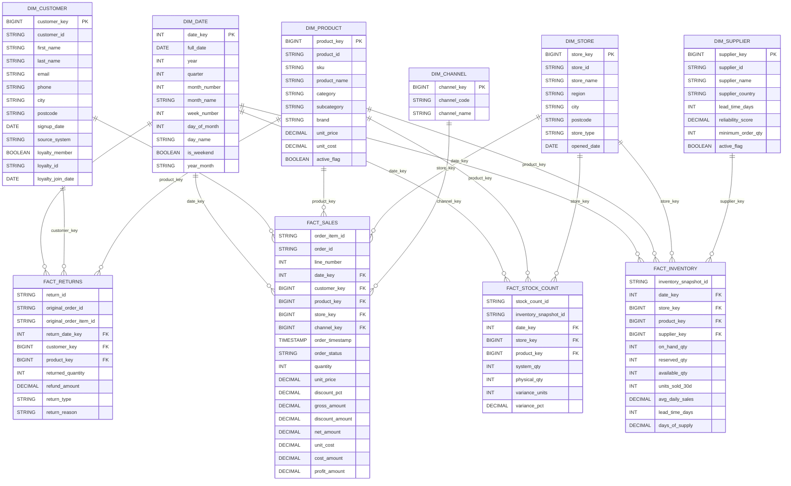

# RetailVerse Data

## Purpose

This dataset was created using the Python Faker library, allowing controlled synthetic data generation at a scale appropriate for OLAP. The purpose is to satisfy the data requirements of the RetailVerse case study context, support the development of an effective and optimised OLAP design, as well as testing a multitude of edge case scenarios.

The dataset is intended to provide support for the three analytical cases that have been provided in the week 2 briefing:

- Sale performance analysis, including revenue analysis by sales channel, store, region, product, and time period

- Customer retention analysis, including the identification of first time, returning, inactive, reactivated, and loyalty customers

- Inventory exception analysis, including the detection of negative inventory instances, stock count variances, reservation anomalies, and stock avaliability risks

Note that this data is synthetic and is and approximation of realistic retail data. There is likely some nuance missing in this data relative to the real case. Instead of investing massive amount of time creating an excessively faithful retail data generation basis, I have elected to provide a reproducible and sufficiently realistic retail environment containing approximations of normal business activity, meaningful analytical patterns, and some deliberately unusual but valid records, as well as common data quality defects.

This approach allows the OLAP transformations, analytical queries, data quality constraints, reconciliation checks, and performance optimisations to be tested against a dataset where the generation logic and expected data anomalies are known and documented.

## Business Context

The underlying context revolves around RetailVerse, which is a fictitious large retailer that operates across a multitude of different business channels and systems.

With this in mind, the sample data that has been generated  supports:

- physical retail stores
- ecommerce
- mobile commerce
- customer and loyalty services
- product and supply managmenet 
- product procurement
- inventory management

Furthermore, it is stated in the wider case study that RetailVerse has grown through acquisition. Therefore, is current operational environement is populated with characteristics commonly encountered in larger organisations such as:

- multiple source systems
- inconsistencies in business codes
- duplicated customer records
- mismatching in identifiers
- incompleteness of data
- differences in operational definitions
- historical systems operating alongside newer platforms
- data quality issues that could negatively impact analytical reporting downstream

The sample data intentionally contains both standardised and nead business data, in conjunction with the controlled injection of defects to emulate realistic conditions.

## Scale

The final generated dataset contains appoximately:

- 50100 raw customer records
- 500 products catalogued 
- 30 physical stores
- 50 suppliers
- 174435 total orders
- 533118 items ordered
- 31009 returned orders
- 500 product to supplier mappings
- 15000 inventory positions
- 4500 physical stock counts
- 500 transaction defects
- 500 inventory defects

A larger dataset was chosen for the following reasons:

- Firstly, it provides sufficient volume for aggregations, joins, window functions, customer cohort analysis, and inventory exception queries to behave more like realistic analytical workloads rather than a simple demo

- Secondly, the larger volume in the fact table provides a sufficient basis to demonstrate OLAP performance optimisation techniques to increase read speed. 

## Coverage

The total generated transactional history covers two calendar years, spanning from 1st January 2024 to 31st December 2025. This is intended to permit partitioning by year to increase speed and for neat data fields such as quarters in the date dimension table.

## Note On Data Generation

### Forcing Certain Completed Purchases

Orders can have states like COMPLETED or CANCELLED. This is normally ideal since real retail systems contain order cancellations. However, some transactions are essential for defining a customer's behavioural cohort classification.

To illustrate this, consider a reactivated customer. For a customer to be reactivated the need to:

- Complete a purchase 
- have a long gap
- then complete another purchase

So for reactivated customers, the initial purchase, and the purchase following their long gap in activity must not be cancelled so the record actually represents a reactivated customer.

This is one of the reasonings around forcing certain purchases to be completed so certain cohorts are logically consistent and satisfy the intended customer behaviour.

Other than the case of force order completion for reactivated customers, all other order remain entirely probablistic in nature.

This data generation design choice was made to enable both realism in cancellation behaviour and a more reliable synthetic ground truth.

### Returns Generated Seperate From Sales

I decided to isolate returns and sales. Instead of represented returns as negative quantity `quantity = -1` inside the sales table, a seperate return event has been created.

To explain conceptually, consider an original sale priced as £100. Then this order is returned and there is a refund of £40. Then, the gross sale value is £100, by refunding £40, the realised value of the sale is £60.

This is intended to preserve business meaning. Negative sales rows say something has gone backwards, but neglects detailing why.

So the use of an explicit returns fact essentailly says 'this is a return event connected to an earlier sale' which is more beneficial for coherent and understandable analysis.

### Deliberate Injection Of Defects

The intentional imperfection of the data serves to promote realism. Example of such injections include:

- unknown customers
- unknown products
- missing store references
- duplicate orders
- duplicate order items
- negative quantities
- invalid discounts
- negative inventory
- high stock variance

Injections are controlled and intentional to aid distinguishing between:

- valid normal business data typical or normal business activity
- valid but unusual data such as a bulk order. The order volume might be high but its not unheard of
- invalid data, such as `discount_pct = 1.35` which means a 135% discount, which sould fail a business rule enforced by data constraints.

### Use of Defect Registers

Deliberately bad records have been tracked with a defect register. This is paramount for establishing a synthetic ground truth for the source data.

I have elected to do this for more thorough validation. When the quantity and nature of the defects are known, SQL can be validated against the register.

Instead of simply saying that a SQL query identified bad rows, we can be more detailed and say something along the lines of "The query detected 496 of the 500 injected defects and produced 3 false positives" which is better quality testing and validation.

### Dimensional Modelling 

The transition from operational writing intensive OLTP to OLAP is in the organisation of data into facts and dimensions.

Dimensions describe entities such as customers, products, stores, etc...

Dimensions provide context. The who, what, where, when, and which that describe business entities.

Facts record the measurable events derived from transactions. This can include sales, returns, snapshots of inventory, and stock counts. 

Facts intend to answer the Hows (how many and how much) and whats (what is the values, what is the variance of x entity).

Intuitively, facts are like verbs, and dimensions are like nouns and adjectives.

### Grain

Before constructing the fact and dimension tables, the grain is determined. This grain states what one row in a table represents.

The grain decided for the fact tables are:

- `fct_sales` One row per order item. If an order contains multiple items, these become multiple rows in the fact table. This is to support sales aggregations without losing specific detail on items being sold.

- `fct_inventory` One product at one store on sone snapshot date. 

- `fct_stock_count` One physical count event for one product at one store.

These grains have been decided to allow maximum detail while avoiding business entities being counted multiple times.

### Surrogate Keys

Surrogate keys have been used since operational systems already have unique identifiers for fields such as customer IDs (CUST00011) and product IDs (PRED000231). These are the business keys, which are good for transactions and in isolated system that are static.

The dimensions also receive keys specific to warehouses e.g:

```txt
customer_key = 12343
produt_key = 88
store_key = 12
```

These are surrogate keys.

Fact tables reference the surrogate keys. Considering customerID as an example:

- At source the customerID uses business/natural keys such as CUST002312
- Within the customer dimension table `dim_customer` a customer surrogate key is created such as 123431
- This surrogate key is what connects to entities within fact tables that reference the customer dimension table

This is done because data warehouses should not have very tightly coupled source and system identifiers, since entities at the source layer may not remain static.

Business identifiers change, multiple systems can use conficting IDs, making the source buisness keys unstable. Surrogate keys solve this by creating a new key which does not get mutated.

### Unknown Members

There is deliberate injection of orders referring to customers that do not exist in `dim_customer`.

For example, a source may say that `customer_id = C00023412` but the customer doesn't exist.

In this case there are 3 approaches:

- Drop the sale: very bad as revenue just disappears
- Leave the key as NULL: this is valid but can be not ideal for joins
- Mapping to unknown member: the approach chosen

When customerID does'nt exist, the surrogate key becomes `customer_key = -1` meaning that the business event does in fact exist, but the customer dimension lookup has failed.

Within the dimension table, -1 maps to UNKNOWN and UNKNOWN CUSTOMER. Then using 

```sql
COALESCE(dim_customer.customer_key, -1)
```

(basically means if customer_key in the customer dimension table is NULL, use -1 which represents UNKNOWN)

This maps failed lookups and preserves the sale, while also exposing a data quality problem.

### Note On `store_key`

`store_key` can be equal to 0. This is to resolve some semantic issues.

Originally ecommence/mobile rows had `store_id = NULL` since these channels do not have physical stores as they are online based.

With the NULL logic presented in the last section, I got `store_key = -1` which is semantically incorrect.

For ecommerce for example. The store isnt unknown, its just that the physical store does not apply in this circumstance.

So another mapping is used to represent if physical stores are applicable or not. 

To summarise:

- -1 = Unknown / defective references
- 0 = Not applicable
- 1+ = Valid 

---
 
## ER Diagram For OLAP




---


